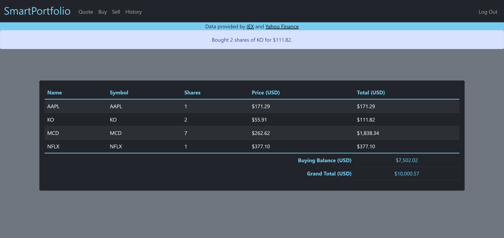
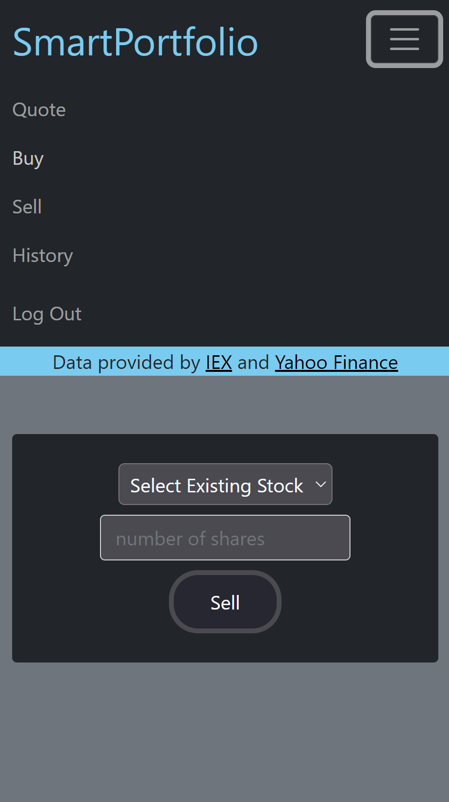
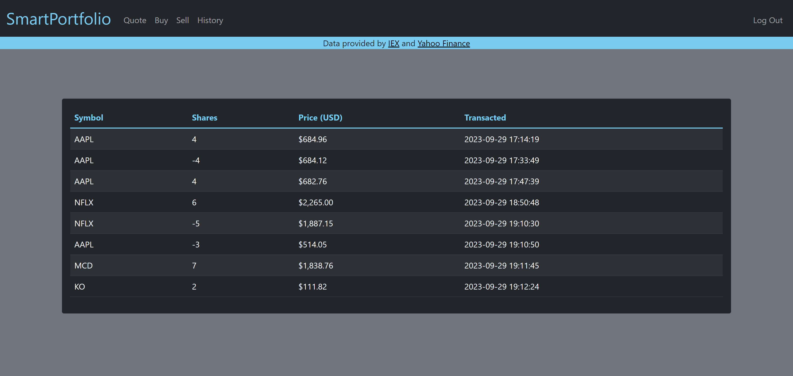

# stock-portfolio

Responsive interface displaying stock data, analytics, purchase history, with options to buy and sell.

## Codebase

* Web framework: Flask
* Database: SQLite

## Citations

Data resources and starter code: [CS50 Pset 9](https://cs50.harvard.edu/x/2023/psets/9/finance/)

All real-time stock information is provided by [https://iexcloud.io/](https://iexcloud.io/) and [https://ca.finance.yahoo.com/](https://ca.finance.yahoo.com/)

[Note](https://cs50.harvard.edu/x/2023/honesty/) only helper functions, data visualization functions, and python package requirements are public.

## User Interface

